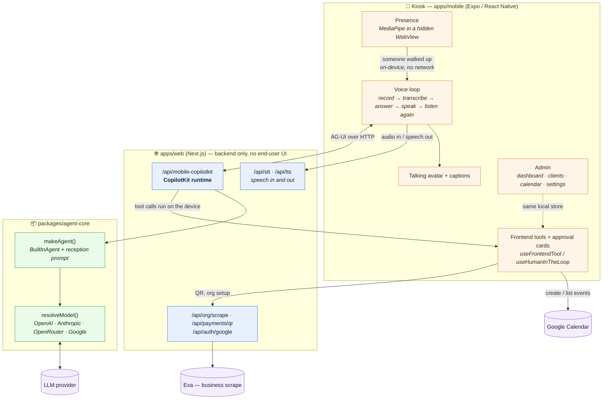
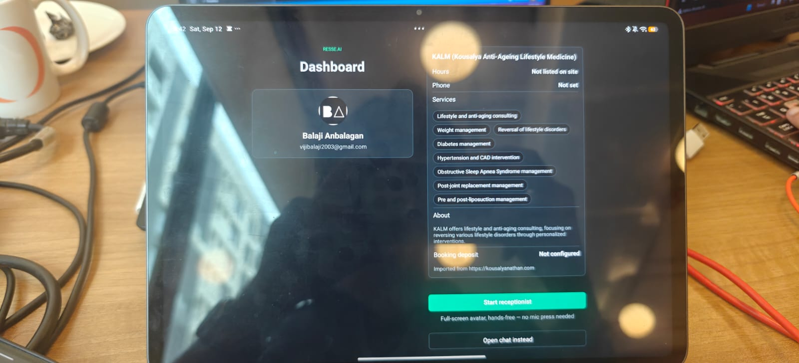
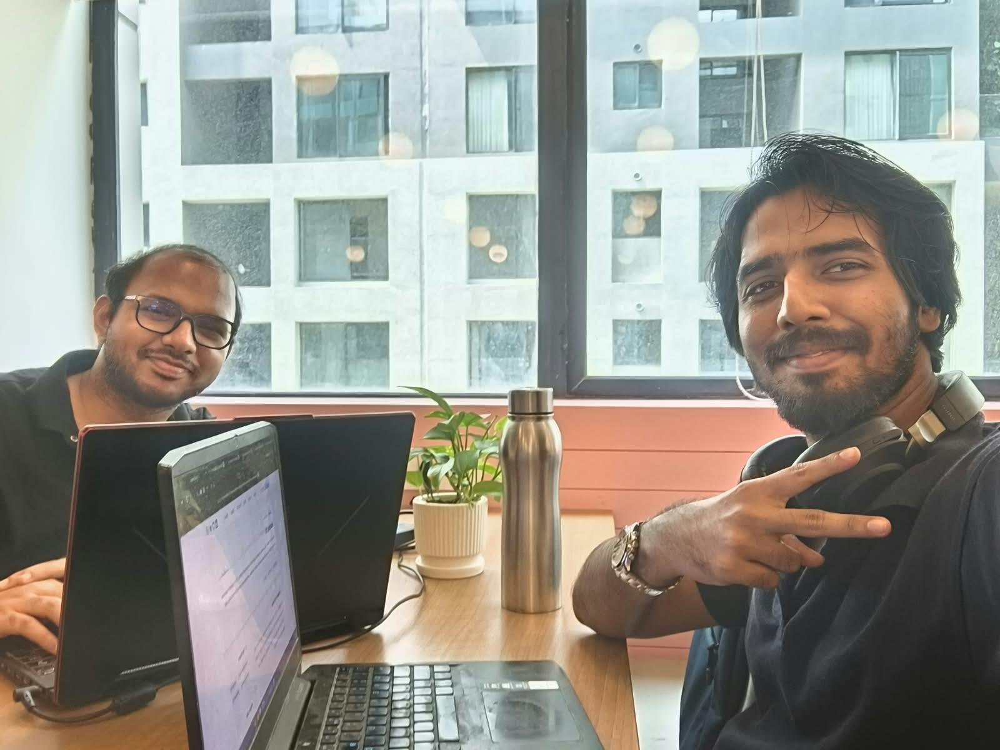

# Resse.ai

**An AI front-desk agent that runs on a physical kiosk — an old phone or tablet mounted where customers actually walk in.**

Someone walks up, the kiosk notices them, listens, answers out loud, and books them in. No app to install, no "press 1 for reception", no website form. Point it at a business's URL and it's running in about a minute.


**[See the project page →](https://ksaisathish.github.io/resse.ai/)** · Built for AI Tinkerers' **Agents, Everywhere** hackathon (Sept 12–13, 2026), forked from the [CopilotKit starter kit](https://github.com/CopilotKit/agents-everywhere-starter-kit).

A real exchange from the tablet above — it declined to invent a service the clinic doesn't offer, and proposed a slot that was actually free:

> **Visitor:** "I would like to book a general consultation."
>
> **Resse.ai:** General consultation isn't one of the listed services. Would you like me to book it as a Checkup at ten in the morning on Monday, 14 September?

## What it does

- **Notices you.** On-device face detection (MediaPipe) starts the conversation — no wake word, no button.
- **Talks.** Speech in, speech out, with a video avatar whose mouth moves while it speaks, plus on-screen captions.
- **Takes turns.** It answers, then listens again for the follow-up, and ends the conversation when you walk away or stop talking.
- **Books real appointments.** It knows today's date, checks opening hours and existing bookings, offers real open slots, writes the event to Google Calendar, and shows a UPI QR for a deposit.
- **Asks before it acts.** Every write — a booking, a check-in — renders an approval card that a human taps. The agent proposes; a person decides.
- **Has an owner's view.** A separate admin surface for the business: dashboard, clients, an appointments calendar, and settings.

## How it fits together



The kiosk holds the tools and the app state; the backend holds the runtime, the API keys, and the media routes. Tool calls are executed **on the device** (that's how it can open the dialer, show a QR, or block on an approval tap) while the model runs server-side.

## Get started

Node.js 22+.

```bash
git clone https://github.com/ksaisathish/resse.ai.git
cd resse.ai
npm ci
cp .env.example .env
```

Set a model provider in `.env` (OpenAI or OpenRouter — see [using-sponsor-tools.md](using-sponsor-tools.md#openai)). `OPENAI_API_KEY` is also what powers speech-to-text and the optional realistic voice. Then:

```bash
npm run dev:web
```

In a second terminal:

```bash
cd apps/mobile
npm ci
npm start
```

Press `i` for iOS Simulator, `a` for Android, or scan the QR with Expo Go. On a physical device `localhost` means the *phone* — set `EXPO_PUBLIC_RUNTIME_URL` to your laptop's LAN address first. See [apps/mobile/README.md](apps/mobile/README.md).

Google Calendar and Google sign-in need a Google OAuth client; booking works without it, minus the calendar write.

## Repository layout

| Path | What it is |
|---|---|
| [apps/mobile](apps/mobile/) | The Expo/React Native kiosk — the actual product surface |
| [apps/web](apps/web/) | Backend only: CopilotKit runtime, STT/TTS, vision, scrape, payments, Google OAuth. No end-user UI. |
| [packages/agent-core](packages/agent-core/) | Model adapter, prompts, and capabilities shared by every surface |
| [packages/presence](packages/presence/) | Camera presence detection — on-device MediaPipe, or a cloud vision fallback |
| [packages/stt](packages/stt/) · [packages/tts](packages/tts/) | Speech in and out, with silence-based auto-stop |
| [packages/talking-avatar](packages/talking-avatar/) | Two-layer video avatar that crossfades between idle and talking |
| [packages/tool-status-banner](packages/tool-status-banner/) | "Finding open times…" status while a tool runs |

`apps/mobile` is deliberately **not** an npm workspace member — Expo pins its own React Native version stack, and hoisting it into the root workspace breaks it. It installs separately.

## The owner's side



Onboarding is pasting a URL: [Exa](https://exa.ai) fetches the site and a cheap extraction pass turns it into the receptionist's knowledge — services, hours, description. Behind it sits an admin surface with today's numbers, the client directory, an appointments calendar, and settings for voice, avatar and integrations.

## Design decisions worth knowing

- **Expo Go, no dev client.** The whole app runs by scanning a QR code. That ruled out every native face-detection module, so presence runs MediaPipe's WASM build inside a hidden WebView instead — real on-device inference, no native module. See [packages/presence/README.md](packages/presence/README.md).
- **The agent proposes, a human disposes.** Reads render cards; writes render approval cards. The kiosk never silently changes anything, and it never places a call or sends an SMS itself — it opens the phone's own dialer/composer with the fields filled in.
- **No automatic payment verification.** The UPI QR is real; confirming payment is a human looking at the payer's phone and tapping confirm. Wiring a payment gateway is the obvious next step, and deliberately out of scope here.
- **Local-first data.** Clients and appointments live on the device (AsyncStorage), shared between the kiosk and admin screens. There's no multi-device sync yet.

## Status

Working end to end: onboarding by URL scrape, hands-free voice conversation with follow-up turns, on-device presence, slot suggestions, booking with Google Calendar write and UPI QR, approval-gated check-ins, and the admin surface.

Known gaps, all deliberate for a two-day build: no Google token refresh (~1h sessions), no payment-gateway verification, no reschedule/cancel tool, no server-side database, and reviews collection isn't built.

## Verify

```bash
npm run verify          # typechecks + offline tests for the backend and packages
cd apps/mobile && npm test && npm run typecheck
```

## Who built it



Balaji Anbalagan and Saisathish Karthikeyan, over four hours at AI Tinkerers' *Agents, Everywhere* hackathon.

The project page in [docs/](docs/) is served by GitHub Pages — enable it under **Settings → Pages → Source: `main` / `/docs`**.

## Reference docs from the starter kit

These describe the original hackathon and sponsor setup. They're still accurate for tooling and config, even though the sample scenario they use (an on-call incident bot) isn't what Resse.ai builds.

- [hackathon-overview.md](hackathon-overview.md) — the event, surfaces, and judging rubric
- [using-sponsor-tools.md](using-sponsor-tools.md) — OpenAI/CopilotKit/OpenRouter/Exa/Auth0/Ambiguous AI setup
- [AGENTS.md](AGENTS.md) — repository conventions for a coding agent working here
- [dev-docs/](dev-docs/) — model switching, deployment, troubleshooting
